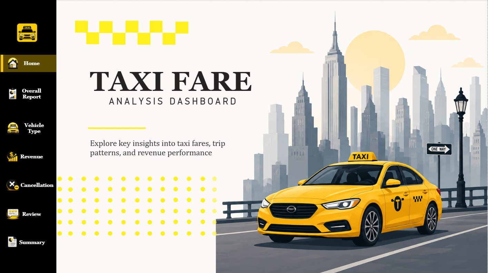
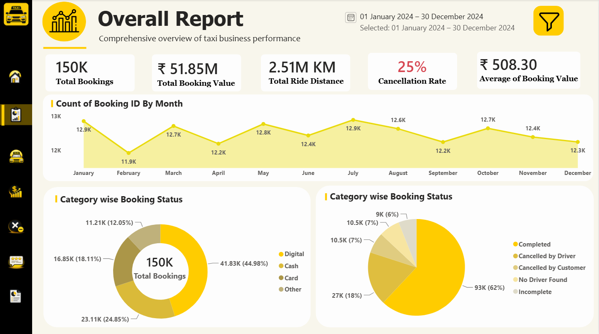
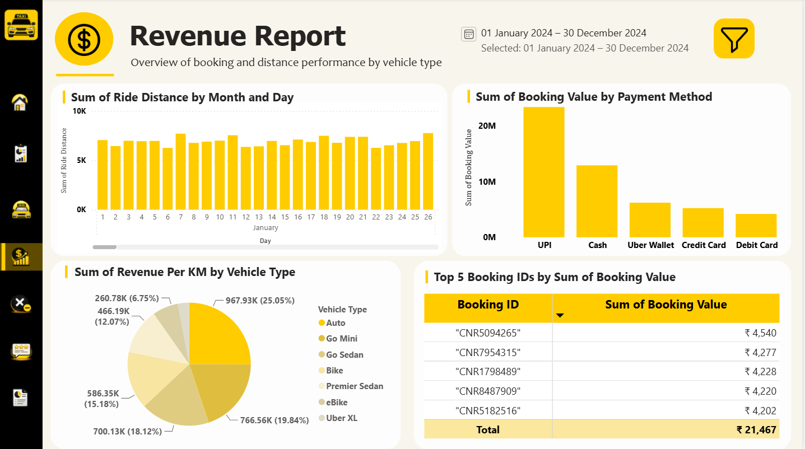
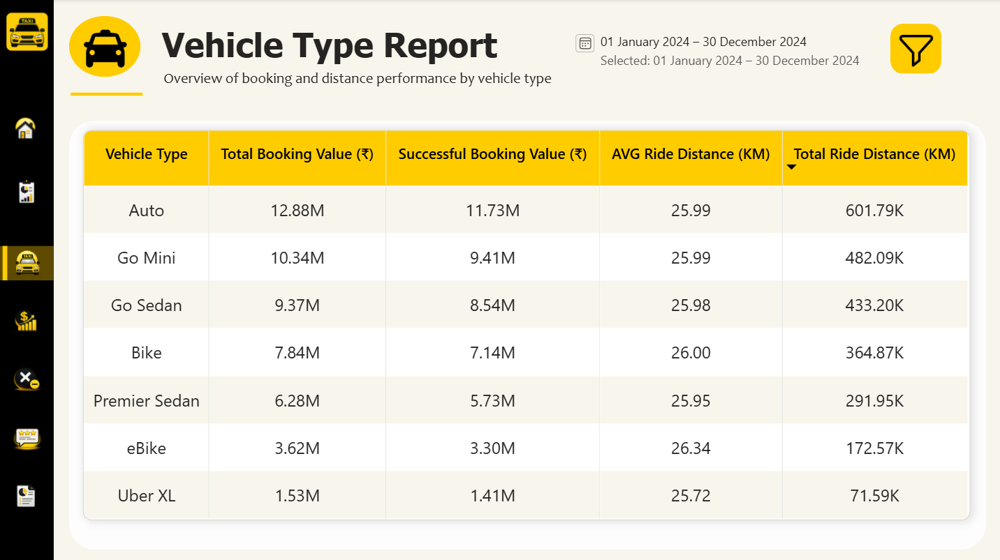
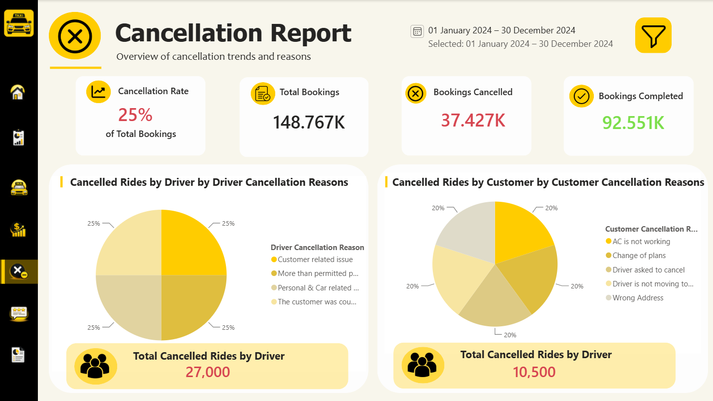
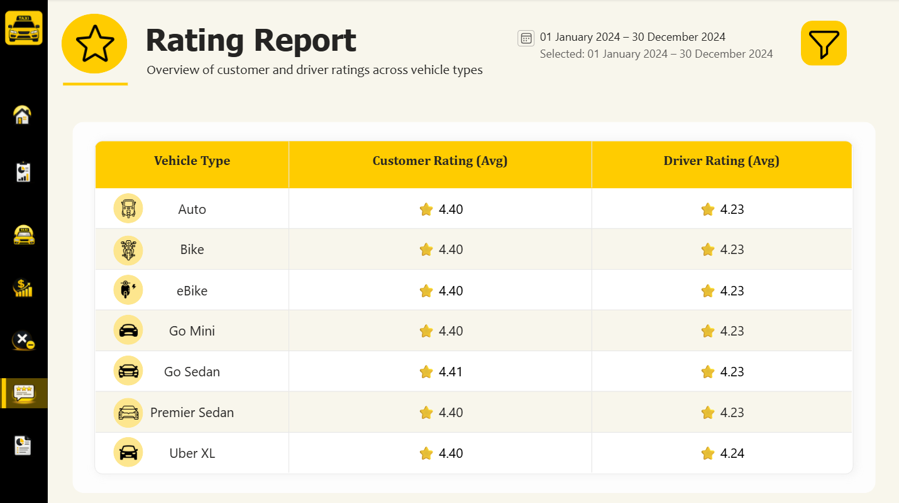
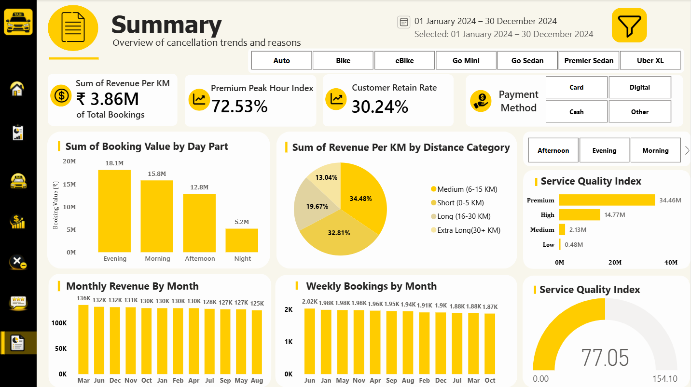

# 🚖 Taxi Fare Analysis Dashboard

An interactive **Power BI** dashboard that analyzes taxi booking operations, revenue performance, cancellations, ratings, and business KPIs — built on 148K+ real booking records.

---

## 📖 Overview

The Taxi Fare Analysis Dashboard transforms raw taxi booking data into actionable business insights. It tracks booking volume, revenue, cancellation patterns, customer/driver satisfaction, and operational efficiency across six interactive report pages, helping stakeholders make data-driven decisions without digging through raw CSVs.

**Business problem:** Taxi platforms generate huge volumes of booking data daily. Without structured reporting, it's hard to spot cancellation trends, measure revenue health, or evaluate service quality. This dashboard centralizes that analysis into one interactive tool.

---

## 🛠️ Tech Stack

- Power BI Desktop
- Power Query (data cleaning & transformation)
- DAX (custom measures & KPIs)
- CSV dataset (148K+ records)
- Data modeling & interactive visualization

---

## 📂 Dataset

**148,767** taxi booking records with fields including Booking ID, Booking Date, Vehicle Type, Booking Value, Ride Distance, Payment Method, Booking Status, Customer Rating, Driver Rating, and Cancellation Reason.

---

## 📊 Key Insights

- **150K bookings** generated **₹51.85M** in total value across the year, averaging **₹508** per booking, over **2.51M km** ridden.
- **25% of all bookings were cancelled** — 18% by drivers vs. 7% by customers, meaning driver-side cancellations are the dominant loss driver (37.4K cancelled out of 148.7K bookings).
- **Digital payments lead adoption** at 45% of bookings, followed by cash (25%) and card (18%) — with UPI alone driving the highest revenue of any payment method.
- **Auto and Go Mini are the top revenue generators** by distance, with Auto alone contributing ₹12.88M in total booking value (601.79K km ridden).
- **Ratings are stable across vehicle types** — customer ratings hover at 4.40★ and driver ratings at 4.23★ regardless of vehicle class, suggesting service consistency rather than vehicle-driven satisfaction gaps.
- **Evenings drive the most revenue** (₹18.1M), nearly 3.5x more than nights (₹5.2M), highlighting peak demand windows.
- **Medium (6–15km) and Long (16–30km) trips** together account for ~67% of revenue per km, making them the core ride segment.
- **Customer Retention Rate sits at 30.24%**, with an overall Service Quality Index of 77.05/154.10 — a useful benchmark for tracking improvement over time.

---

## 📈 Dashboard Pages

### 🏠 Landing Page
Branded navigation hub with quick access to all reports.

### 📊 Overall Report

- Total Bookings, Booking Value, Ride Distance, Cancellation Rate, Avg. Booking Value
- Monthly booking trend (Jan–Dec)
- Booking status & payment method distribution

### 💰 Revenue Report

- Revenue by payment method
- Revenue per km by vehicle type
- Daily ride distance trend
- Top 5 revenue-generating bookings

### 🚕 Vehicle Type Report

- Total & successful booking value by vehicle type
- Average and total ride distance per vehicle type
- Side-by-side vehicle performance comparison

### ❌ Cancellation Report

- Overall cancellation rate (25%)
- Driver vs. customer cancellation reasons (breakdown by category)
- Completed vs. cancelled bookings

### ⭐ Rating Report

- Customer & driver average ratings
- Vehicle-wise rating comparison table

### 📋 Summary Dashboard

- Revenue per km, Customer Retention Rate, Premium Peak Hour Index
- Revenue by day part & distance category
- Monthly revenue and weekly booking trends
- Service Quality Index (gauge + segment breakdown)
- Cross-page interactive filters (vehicle type, payment method, day part)

---

## 🧮 DAX Highlights

A few custom measures power the Summary Dashboard's advanced KPIs:

- **Premium Peak Hour Index** — measures how much premium-tier bookings contribute during high-demand hours relative to overall volume.
- **Customer Retention Rate** — % of customers with more than one completed booking in the selected period.
- **Service Quality Index** — a composite score blending rating and completion metrics, segmented by service tier (Premium/High/Medium/Low).

---

## 🚀 How to Use

1. Download `Taxi_Fare_Analysis.pbix` from this repository.
2. Open it in **Power BI Desktop** (2023 or later recommended).
3. Use the left navigation bar to move between report pages.
4. Apply filters (date range, vehicle type, payment method) to explore the data interactively.

---

## 📸 Preview

| Overall | Revenue | Cancellation |
|---|---|---|
|  |  |  |

| Rating | Vehicle Type | Summary |
|---|---|---|
|  |  |  |

---

## 👤 Author

**Mahesh Ghule**
📧 maheshghule175@gmail.com 

## 📄 License

This project is for portfolio and educational purposes.